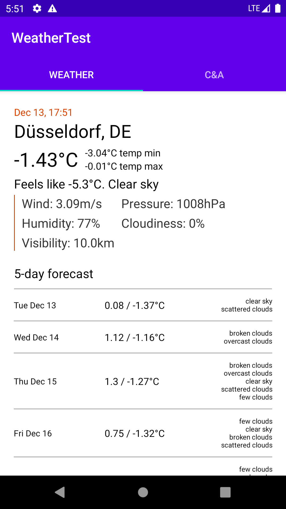

# Weather and Webview

This project contains two tabs. In the first one, we can check the current weather of the city of Düsseldorf and the forecast of the next 5 days.
In the second one, we can see a webview with the home page of C&A

Weather                   | Webview
------------------------- | ---------------------------
 | 

### Architecture
- Clean architecture
- MVVM

### Testing
- Mockito
- Coroutine test

### Technologies
- Retrofit & OkHttp
- Coroutines
- Hilt
- ViewModel & Livedata
- View Binding

[Weather API](https://openweathermap.org/)
